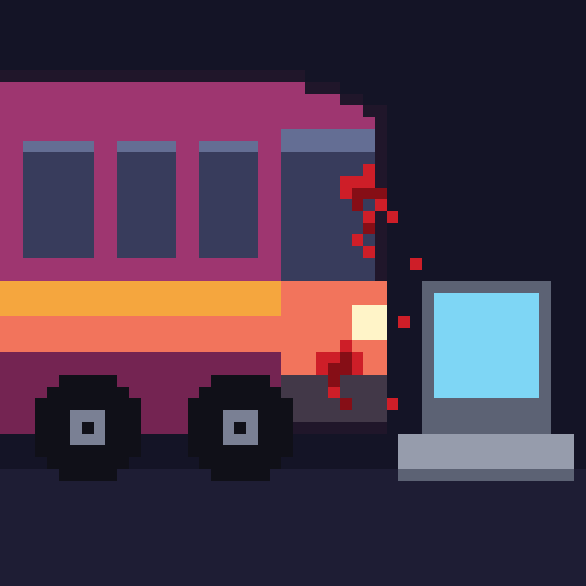

# Bus Factor HQ

**Simulador arcade de emergencias organizacionales.** Track: 🚨 Emergencies · Platanus Hack 26 Bogotá · team-24



> *"¿Qué pasa si mañana tu CTO no llega? Nosotros ya lo simulamos… y tu empresa sobrevivió."*

Todo equipo tiene un **bus factor de 1** en algo: una sola persona que sabe comprar los vuelos del jefe, que es admin del CRM, que sabe hacer el rollback cuando el despliegue falla. Ese conocimiento no vive en la documentación — vive en hilos de Slack, en reuniones que nadie vuelve a ver y en la cabeza de la gente.

Bus Factor HQ lee lo que el equipo ya produce en Slack, GitHub y las grabaciones de Meet, y construye solo el mapa de **quién sabe qué**. Con ese mapa simula emergencias sobre una oficina pixel art —una renuncia, el robo de un computador, la caída de GitHub— y genera en segundos el documento de empalme. Cada viernes reparte misiones de descentralización para que ese número nunca sea 1.

Descripción completa para el jurado: [`project-description.md`](./project-description.md).

---

## Arquitectura

Cinco piezas encadenadas. Cada una depende solo del contrato de la anterior, nunca de su código, y hasta que la anterior exista trabaja contra mocks.

```
P1 Ingesta  →  P2 Cerebro IA  →  P3 Backend  →  P4 Juego
                                             →  P5 Dashboard
```

| Pieza | Qué entrega | Estado |
|---|---|---|
| **P1 Ingesta** | `RawEvent[]` normalizado desde Slack, GitHub y Meet, en `data/raw/*.json` | pendiente |
| **P2 Cerebro IA** | `cerebro/` — extracción de conocimiento, riesgo, simulación y quests | **funcionando** |
| **P3 Backend** | API REST en FastAPI + Supabase (auth, oficina, simulaciones) | pendiente |
| **P4 Juego** | La oficina viva en React + Phaser | pendiente |
| **P5 Dashboard** | Digest, quests, puntaje y visor del playbook | pendiente |

Los frontends nunca hablan con Slack ni con Claude: solo con la API de P3.

Los documentos de trabajo de cada pieza están en [`bus-factor/`](./bus-factor/), junto con el
[documento maestro](./bus-factor/bus-factor-hq-hackathon.pdf) y la
[investigación de herramientas libres](./bus-factor/P2-investigacion-herramientas.md).

## Cómo correr lo que hay hoy

```bash
uv venv --python 3.12
uv pip install anthropic pydantic
export ANTHROPIC_API_KEY=sk-...      # sin esto todo cae a datos mock, no falla

python -m cerebro                    # la cadena completa: riesgo, simulación, quests
python test_cerebro.py               # 23 checks, sin red ni API key
python -m cerebro.validacion         # informe de calidad de la extracción
```

`python -m cerebro` imprime la oficina con el score de cada persona, simula la renuncia de quien
esté en rojo y muestra el playbook de empalme y las quests de la semana.

### El contrato

```python
from cerebro import cargar_eventos, extraer, calcular_riesgo, simular, generar_digest

eventos = cargar_eventos()                                      # data/raw/, o el fixture
items   = extraer(eventos)                                      # list[KnowledgeItem]
scores  = calcular_riesgo(items, eventos)                       # list[RiskScore]
sim     = simular("renuncia", items, "ana@empresa.com", eventos)  # SimulationResult
quests  = generar_digest(items, scores, eventos)                # list[Quest]
```

Detalles, fórmula de riesgo y flag `mock=True` en [`cerebro/README.md`](./cerebro/README.md).
Los esquemas compartidos viven en [`cerebro/esquemas.py`](./cerebro/esquemas.py) y son el contrato
del equipo: cualquier cambio se avisa a todos.

## Stack

Claude API para extracción y generación · Python + FastAPI · Supabase con pgvector y Auth ·
React + Phaser.js para el juego · React + Tailwind para el dashboard · Slack, GitHub y Google Drive
para la ingesta.

## Equipo

- Brayan Barajas ([@brayanb1701](https://github.com/brayanb1701))
- David Santiago Morales Norato ([@david-morales-norato-inerxia](https://github.com/david-morales-norato-inerxia))
- Ana Sofía Suárez Arismendy ([@anasofiasa](https://github.com/anasofiasa))
- Jorge Alfredo Jaimes Teheran ([@jhosgun](https://github.com/jhosgun))
- Andres Felipe Uribe Garcia ([@andres-inerxia](https://github.com/andres-inerxia))

## Despliegue

Vercel, Render y Netlify solo pueden conectarse a repositorios propios, no a este repo de la
organización. Para desplegar manteniendo los commits acá, apunta `origin` a los dos remotos:

```bash
git remote set-url --add --push origin https://github.com/platanus-hack/platanus-hack-26-co-team-24.git
git remote set-url --add --push origin https://github.com/<tu-usuario>/<tu-repo>.git
```

Desde ahí, `git push` actualiza ambos y el servicio de despliegue se conecta al repo personal.
